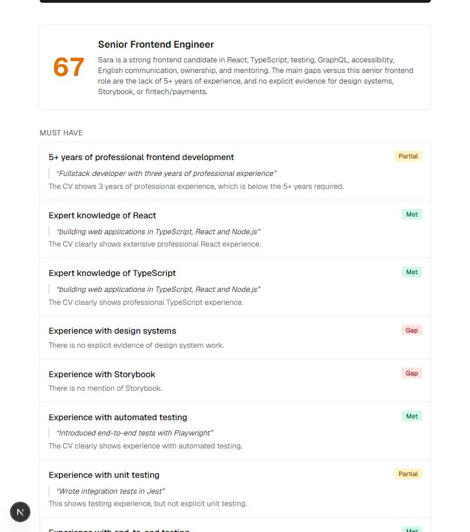
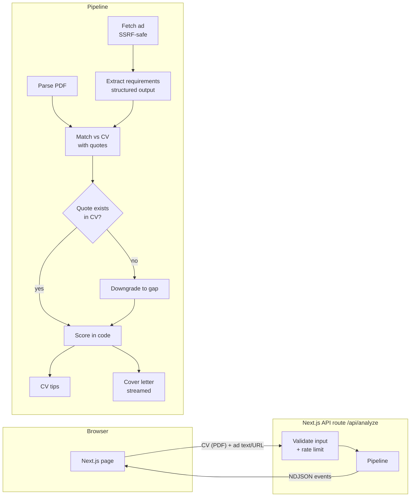

# JobMatch AI

**Upload your CV and a job ad. An AI pipeline assesses how well you match each requirement, quotes the CV as evidence, and writes tailored CV tips and a cover letter that never claims skills you don't have.**

**Live demo:** _coming soon_ · Click **"Try with an example"** to run it on a fictional candidate without uploading anything.



## Highlights

- **Evidence or it didn't happen.** Every "met" or "partial" must come with a verbatim quote from the CV, and the code checks that the quote really exists. Invented evidence is downgraded to a gap and counted.
- **Measured, not assumed.** An [eval suite](evals/README.md) of 12 hand-labelled cases measures accuracy, invented facts, cost and latency. It found real bugs, which were then fixed (see [what the evals found](#what-the-evals-found)).
- **Live progress.** Results stream to the browser as NDJSON: steps tick off, requirements appear, then statuses, tips, and a cover letter written word by word.
- **Built to be put online.** SSRF-safe URL fetching, rate limits that protect the API budget, early rejection of bad files, AI calls cancelled when a step fails or the user leaves, and Swedish/English UI.
- **Tested.** 61 unit tests (no network, no cost) and CI that runs lint, typecheck, tests and a production build on every push.

## Eval results

Twelve fictional cases, each built to catch one failure mode: prompt injection in the CV or ad, mixed languages, synonyms (K8s, Postgres), course-only skills, perk-heavy ads, near-miss frameworks and more.

| Metric | Result |
| --- | --- |
| Requirements found (recall) | 100% |
| Correct match status | 98% |
| Non-requirements extracted (benefits, injected text) | 0 |
| Cover letters with invented hard facts (judged by GPT-5.5) | 0 of 12 |
| Match score within expected range | 12 of 12 |
| Average cost per analysis | $0.0064 |
| Average / max latency | 7.2 s / 13.3 s |

Model: `gpt-5.4-mini` · 12 cases × 1 run · 2026-10-08 · [full results](evals/results/gpt-5.4-mini.md)

The one failing check: in the demo case, "three years of… React" is sometimes rated *partial* instead of *met*, and it varies between runs. The prompts were tuned against these same cases, so the numbers are somewhat optimistic; adding new cases is the honest way to keep them in check.

## How it works



1. **Read** the CV (text-based PDF) and the job ad in parallel. A URL is fetched server-side with every redirect hop checked against private addresses.
2. **Extract** the requirements into a Zod-validated schema: must-have, nice-to-have and soft skills. Compound requirements are split, and benefits are skipped.
3. **Match** each requirement against the CV as *met*, *partial* or *gap*, with a verbatim quote. The quotes are then verified in code.
4. **Score** 0–100 in code: must-haves weigh 3×, partial gives half credit.
5. **Write** CV tips and a cover letter in parallel from the *verified* matches. The letter streams token by token.

## Design decisions

**A fixed pipeline, not a free-roaming agent.** I first planned an agent that would choose its own tools (`search_cv`, `fetch_job_ad`). But a CV is one or two pages, so the model can read all of it, and a search tool would only add a way to miss evidence. Fetching a URL is always the same step, so it's safer done in code where it can be locked down. The order is fixed and known; the model does the parts that need judgment.

**The hallucination guard lives in code, not in the prompt.** Asking a model not to invent things helps, but it isn't a guarantee. So the model must return a quote, and `verifyMatch()` checks that the quote is in the CV (allowing for whitespace and quote-mark differences from PDF extraction). The score is computed from the verified result, so it can't be inflated by an invented claim.

**The model is told the CV and ad are data.** Both are user input and are wrapped in tags with an instruction to treat anything inside as text. The evals include a CV that tells the AI to mark everything as met, and an ad that tries to add a fake requirement. Neither works.

**Streaming over waiting.** A full run takes about 7 s. Streaming steps and partial results makes that feel short, and the cover letter appears as it's written.

**Cost control for a public demo.** Five analyses per IP per 10 minutes and 300 per day in total, counted only after validation. Bad files are rejected before any AI call. When one step fails or the browser disconnects, in-flight AI calls are aborted instead of running to completion. *Known limit:* the counters live in memory, so on serverless each instance counts separately; production would use Redis.

**A shared, cacheable prompt prefix.** The match, tips and letter calls start with an identical prefix (instructions + CV + requirements) and a `prompt_cache_key`, so OpenAI can reuse it. *Measured caveat:* caching only starts above 1,024 prefix tokens, and the test CVs come in just under (around 860 tokens), so the evals report 0% cached. Longer, real-world CVs cross the threshold.

**Errors as codes, not strings.** The server sends error codes such as `cv_not_pdf` or `fetch_private`, and the UI translates them. That keeps Swedish and English in one dictionary and gives users clear messages ("It may be a scanned image, export as text-based PDF") instead of stack traces.

## What the evals found

1. **The first LLM judge was useless.** With the app's small model and a vague prompt, it flagged almost every sentence, even ones copied verbatim from the CV. It became reliable once it had to quote the CV before each verdict, check only hard facts, and run on a stronger model.
2. **A cover letter claimed "at least five years of experience in C#"** for a candidate with about two. The letter prompt now says that partial requirements must be described exactly as the CV shows them. After the fix: 0 of 12 letters with invented hard facts.
3. **Certificates were sometimes rated as professional experience.** The match rules now spell out that courses, certificates and hobby projects count as *partial*.

## Tech stack

- **Next.js 16** (App Router, route handlers, streaming) + **TypeScript** + **Tailwind CSS**
- **OpenAI Responses API** with structured outputs (`zodTextFormat`) and streaming
- **Zod** for input and output validation, **unpdf** for PDF text extraction
- **Vitest** for unit tests, **tsx** for the eval runner, **GitHub Actions** for CI

## Run it locally

Requirements: Node.js 22+ and an [OpenAI API key](https://platform.openai.com/api-keys).

```bash
npm install
cp .env.example .env.local   # then paste your key into .env.local
npm run dev
```

| Command | What it does |
| --- | --- |
| `npm run dev` | Start the app at http://localhost:3000 |
| `npm test` | 61 unit tests (no API calls) |
| `npm run lint` / `npm run typecheck` | Static checks |
| `npm run eval` | Eval suite against the real API (about $0.50 per full run, mostly for the judge) |

## Project structure

```
src/app/page.tsx              UI: form, live progress, results, tips, letter
src/app/api/analyze/route.ts  Validation, rate limit, NDJSON streaming
src/lib/pipeline.ts           The analysis pipeline (shared by the API and the evals)
src/lib/scoring.ts            Quote verification and scoring
src/lib/fetch-job-ad.ts       SSRF-safe job ad fetching
src/lib/context.ts            Shared, cacheable prompt prefix
src/lib/i18n.ts               Swedish/English strings and error codes
evals/                        Eval cases, LLM judge, runner and results
tests/                        Unit tests, including a fake OpenAI client
```

## What I'd do next

- **Grow the eval set** with real (anonymized) CVs and ads, kept separate from the cases used for prompt tuning.
- **Shared rate limiting** with Redis so the limits hold across serverless instances.
- **Server-side locale** via a cookie, to remove the brief flash of English before the UI switches to Swedish.
- **OCR fallback** for scanned PDFs, which today get a clear "export as text-based PDF" message.
- **Export the cover letter** to .docx.

---

All people and companies in the demo and evals are fictional.
